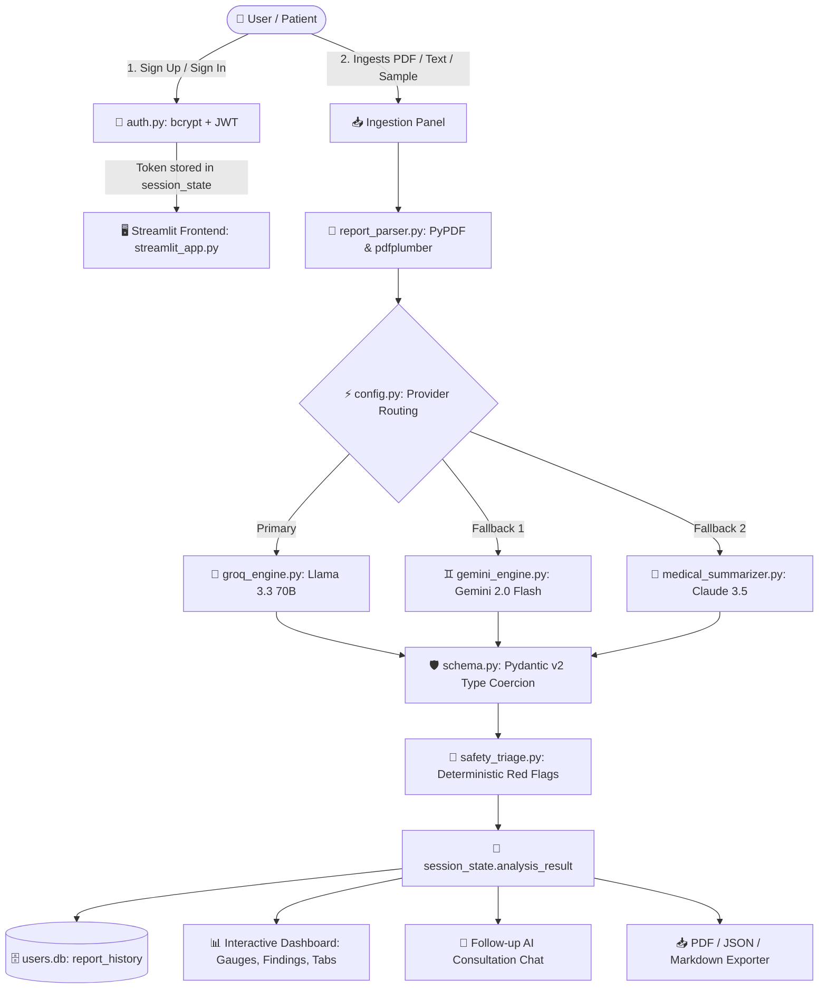

# 🩺 Health Report Summarizer AI Application
## Comprehensive Viva Examination & Project Defense Guide

> **Prepared for**: Academic Project Defense / Technical Viva Examination  
> **Repository**: `Pranavv28/Health-Report-Summarizer-AI-Application`  
> **Tech Stack**: Python 3.12, Streamlit, Groq (Llama 3.3 70B), Google Gemini 2.0 Flash, Anthropic Claude 3.5, Pydantic v2, SQLite (WAL mode), PyJWT, bcrypt, ReportLab, PyPDF, pdfplumber

---

# TABLE OF CONTENTS
1. [Project Overview & Problem Statement](#1-project-overview--problem-statement)
2. [End-to-End System Architecture & Data Flow](#2-end-to-end-system-architecture--data-flow)
3. [Tools, Libraries & Technologies Used (Why Chosen)](#3-tools-libraries--technologies-used)
4. [File-by-File Module Walkthrough](#4-file-by-file-module-walkthrough)
5. [Key Technical & Clinical Terminology (Every Concept Explained)](#5-key-technical--clinical-terminology)
6. [Core Engineering & Safety Innovations](#6-core-engineering--safety-innovations)
7. [Top 25 Viva / Oral Exam Questions & Answers](#7-top-25-viva-oral-exam-questions--answers)

---

# 1. Project Overview & Problem Statement

### 🎯 The Problem
Medical lab reports (CBC, CMP, Lipid Panels, Thyroid, Liver function) are written for trained clinicians using complex Latinate terminology, cryptic abbreviations, and raw numerical ranges. 
Patients receiving their reports experience **"diagnostic anxiety"** and struggle with health literacy:
- What does an elevated mean corpuscular volume (MCV) mean?
- Is high alkaline phosphatase an emergency?
- What questions should I actually ask my physician during our 15-minute consultation?

### 💡 The Solution
The **Health Report Summarizer AI Application** is a secure, HIPAA-conscious clinical AI agent that ingests raw medical reports (PDF scans, text, or sample cases), parses the metrics, validates whether the document is authentic medical data, extracts every biomarker with calibrated visual range gauges, translates medical jargon into plain 6th-grade English, generates actionable doctor consultation questions, and persists report history using encrypted JWT authentication.

### 🌟 Key Deliverables
1. **Multi-Modal Document Parsing**: Handles digital PDFs, text dumps, and image scans.
2. **Multi-Engine AI Orchestration**: Fast Groq LPU inference (Llama 3.3 70B) with automatic fallbacks to Google Gemini 2.0 Flash and Claude 3.5 Sonnet.
3. **Deterministic Safety Net**: A rule-based Python triage layer catches critical laboratory thresholds (e.g. Glucose < 40 or > 600, Troponin positive, Hemoglobin < 7) independent of LLM reasoning.
4. **User Security & Memory**: Salting + bcrypt password hashing, stateless 7-day JWT tokens, and an embedded SQLite database running in Write-Ahead Logging (WAL) mode for persistent report restoration.
5. **Multi-Format Export**: Generates pixel-perfect PDF diagnostic summaries via ReportLab, raw JSON data, and Markdown.

---

# 2. End-to-End System Architecture & Data Flow



### Detailed Lifecycle of an Analysis Request
1. **User Authentication**: User logs in with email and password. `auth.py` validates credentials against bcrypt hash in `users.db`, signs a JWT token with HS256, and stores it in Streamlit's `session_state`.
2. **File Ingestion**: User uploads a PDF/image or pastes laboratory text.
3. **In-Memory Extraction**: `report_parser.py` extracts text using `pdfplumber` (preserving table columns) and `pypdf`. Files are kept transiently in RAM and never written to disk (ensuring HIPAA/privacy compliance).
4. **Prompt Formulation**: Structured system prompts instruct the LLM to act as a board-certified clinical laboratory consultant.
5. **AI Inference**: The active provider (Groq LPU running Llama 3.3 70B) processes the text and returns a strict JSON payload.
6. **Schema Validation**: `schema.py` validates the JSON against `HealthReportAnalysis`. Missing fields are coerced gracefully; hallucinations are caught.
7. **Deterministic Safety Triaging**: `safety_triage.py` scans biomarker numbers directly in Python. If critical values are detected, emergency banners are appended.
8. **Persistence & Display**: The record is saved to SQLite `report_history`. The dashboard renders biometric gauges, decoded jargon cards, and consultation prompts.
9. **Interactive Chat**: Patients can ask contextual questions against the report via a chatbox.
10. **Export**: ReportLab compiles an executive clinical PDF report for download.

---

# 3. Tools, Libraries & Technologies Used

| Technology | Role in Project | Why This Was Chosen (Viva Justification) |
| :--- | :--- | :--- |
| **Python 3.12** | Core Programming Language | Strong type hinting, high performance, robust ecosystem for data science and AI. |
| **Streamlit 1.30+** | Frontend & Web Framework | Enables rapid development of interactive reactive data dashboards in pure Python without needing a separate React/Vue frontend. |
| **Groq API (Llama 3.3 70B)** | Primary LLM Inference | Groq utilizes custom **LPUs (Language Processing Units)** providing extreme token generation speeds (~300-500 tokens/sec), eliminating long analysis wait times for users on a free tier. |
| **Google Gemini 2.0 Flash** | Fallback Multimodal Engine | Offers large context windows and native multimodal reasoning if complex scanned visual charts are uploaded. |
| **Anthropic Claude 3.5 Sonnet** | Fallback Clinical Reasoner | Renowned for exceptional nuance, clinical restraint, and low hallucination rates in complex medical literature. |
| **Pydantic v2** | Data Schema & Validation | Guarantees that LLM outputs conform to strict structural types. If the LLM omits a field or changes a key name, Pydantic detects it or coerces it safely before the UI breaks. |
| **pdfplumber & PyPDF** | Document Parsing | `pypdf` is fast for raw digital text extraction; `pdfplumber` provides high-precision visual coordinates to correctly parse multi-column lab tables. |
| **ReportLab 4.0+** | PDF Generation | Industrial-standard programmatic PDF generation. Allows styling custom flowables, tables, and colors to create clean medical export summaries. |
| **SQLite3** | Embedded Database | Built directly into Python standard library. Zero external server dependencies (no Docker/MySQL setup needed). Perfect for lightweight single-node deployments. |
| **WAL (Write-Ahead Logging)** | Database Concurrency Mode | Standard SQLite locks during writes. Enabling `PRAGMA journal_mode=WAL` allows simultaneous readers and writers, preventing `database is locked` errors during Streamlit reruns. |
| **PyJWT (JSON Web Tokens)** | Session Security | Provides stateless, cryptographically signed authentication tokens with tamper protection (HMAC-SHA256) and expiration timestamps. |
| **bcrypt** | Password Hashing | Uses a slow key-derivation function with cryptographic salt to protect passwords against rainbow table and brute-force attacks. Far superior to plain MD5 or SHA-256. |
| **pytest & pytest-cov** | Automated Testing | Comprehensive test framework verifying parser accuracy, safety triage thresholds, auth CRUD, and end-to-end integration. |

---

# 4. File-by-File Module Walkthrough

### 1. [`streamlit_app.py`](file:///c:/Users/PRANAV%20LAKHE/Flexi%20mini%20project/streamlit_app.py) — Frontend & User Experience
- **Responsibilities**: Controls the user interface, routing, dual-panel layout, session state, custom CSS styling, and dashboard rendering.
- **Key Features**:
  - **Auth Gate**: If `current_user is None`, displays the centered login/signup card.
  - **Top Navigation Bar**: Displays verified status, active AI engine, user initials avatar, and Sign Out button.
  - **Left Sticky Sidebar**: Diagnostic Data Ingestion panel with 3 intake tabs (Upload, Paste, Samples). Stays pinned in view while scrolling long reports.
  - **Right Output Studio**: Dynamic metric stat cards (Total, Flagged, Optimal, Critical), Executive Summary narrative, and 6 tabbed views:
    1. *⚠️ Abnormal Values*: Direct clinical alerts.
    2. *🩺 Key Findings*: Primary clinical bullet points.
    3. *🔬 Biomarker Telemetry*: Range gauge bars, data table, and decoded medical jargon.
    4. *💊 Treatment & Guidance*: Lifestyle tips, medications, doctor questions.
    5. *🤖 Ask AI Agent*: Interactive conversational health assistant with suggested prompts.
    6. *📂 My Reports*: User report memory with 1-click restoration and deletion.
  - **Export Bar**: 1-click export to PDF, JSON, and Markdown, plus "➕ New Analysis" workspace reset.

### 2. [`auth.py`](file:///c:/Users/PRANAV%20LAKHE/Flexi%20mini%20project/auth.py) — Authentication & Persistent Memory
- **Responsibilities**: Manages user accounts, bcrypt password hashing, JWT generation/verification, and SQLite report history CRUD.
- **Key Functions**:
  - `get_db()`: Context manager that opens SQLite with `timeout=15`, enables `WAL` mode, sets `busy_timeout=10000`, and guarantees connection closure in `finally:`.
  - `create_user(name, email, password)`: Hashes password with `bcrypt.gensalt()`, saves user, handles duplicate email uniqueness.
  - `authenticate_user(email, password)`: Verifies plain password against stored hash.
  - `create_jwt(user_id, email, name)`: Generates signed HS256 token valid for 7 days.
  - `verify_jwt(token)`: Verifies token signature and checks for expiration.
  - `save_report(...)` & `get_report_history(...)`: Auto-saves analyses and enforces `MAX_HISTORY_PER_USER = 50` by automatically pruning the oldest entries.

### 3. [`medical_summarizer.py`](file:///c:/Users/PRANAV%20LAKHE/Flexi%20mini%20project/medical_summarizer.py) — AI Orchestration & Reasoning
- **Responsibilities**: Directs analysis requests through prompt engineering, invokes the appropriate LLM engine, handles retry logic, and powers the interactive Q&A assistant.
- **Key Logic**:
  - Defines 3 summary modes: **Brief** (2-3 sentence overview), **Detailed** (full extraction), and **Highlighted** (abnormal-first triage).
  - Enforces system instruction `ANALYSIS_SYSTEM_INSTRUCTION` requiring clinical neutrality, refusal to prescribe unverified drugs, and mandatory advice to seek licensed physician care.
  - `answer_health_question(...)`: Provides context-aware answers to user follow-up questions while maintaining conversational memory.

### 4. [`groq_engine.py`](file:///c:/Users/PRANAV%20LAKHE/Flexi%20mini%20project/groq_engine.py) & [`gemini_engine.py`](file:///c:/Users/PRANAV%20LAKHE/Flexi%20mini%20project/gemini_engine.py) — Model Adapters
- **Responsibilities**: Interfaces with specific provider SDKs (`groq` and `google-genai`).
- **Resilience**: Implements JSON extraction regex guards to strip any accidental Markdown wrapping (````json ... ````) before passing strings to Pydantic.

### 5. [`schema.py`](file:///c:/Users/PRANAV%20LAKHE/Flexi%20mini%20project/schema.py) — Pydantic Validation Models
- **Models**:
  - `Biomarker`: Holds `parameter_name`, `value`, `unit`, `reference_range`, `status` ("Normal", "High", "Low", "Critical"), and `simple_explanation`.
  - `MedicalTermTranslation`: Maps medical terminology to plain English.
  - `HealthReportAnalysis`: Full root model holding patient summary, red flags, questions for doctor, and biomarkers.
- **Defensive Engineering**: Uses `@field_validator(..., mode="before")` to coerce integers or floats into strings to prevent validation crashes if the LLM emits numbers without quotes.

### 6. [`safety_triage.py`](file:///c:/Users/PRANAV%20LAKHE/Flexi%20mini%20project/safety_triage.py) — Deterministic Clinical Triage
- **Responsibilities**: Hardcoded algorithmic safety net.
- **Rule Checks**:
  - Troponin labeled "positive" → Appends acute cardiac event warning.
  - Hemoglobin < 7.0 g/dL → Severe anemia / transfusion alert.
  - Blood Glucose < 40 or > 600 mg/dL → Severe hypoglycemia / diabetic ketoacidosis risk.
  - INR > 4.0 → Hemorrhage risk.
  - Appends universal emergency medical disclaimer if red flags are triggered.

### 7. [`report_parser.py`](file:///c:/Users/PRANAV%20LAKHE/Flexi%20mini%20project/report_parser.py) — Document Ingestion
- **Responsibilities**: Safely handles file uploads.
- **Techniques**:
  - Validates file size (rejects files > 25MB).
  - Tries `pdfplumber` layout parsing first to capture tabular lab values.
  - Falls back to `pypdf` for basic text extraction.
  - Sanitizes Unicode null bytes (`\x00`) and removes unprintable artifacts.

### 8. [`exporter.py`](file:///c:/Users/PRANAV%20LAKHE/Flexi%20mini%20project/exporter.py) — Export Engine
- **Responsibilities**: Generates multi-format deliverables.
- **PDF Engine**: Uses ReportLab `SimpleDocTemplate` with custom color palettes (Emerald headers, zebra-striped biomarker tables, alert callout boxes).

### 9. [`config.py`](file:///c:/Users/PRANAV%20LAKHE/Flexi%20mini%20project/config.py) — Central Configuration
- **Responsibilities**: Manages API keys, model parameters, preloaded clinical case studies (CBC Anemia, Metabolic Diabetes, Lipid Heart Panel), and detects active providers.

---

# 5. Key Technical & Clinical Terminology

### 💻 Computer Science & Software Engineering Terms

1. **JWT (JSON Web Token)**:
   - A compact, URL-safe means of representing claims between two parties. Composed of 3 parts: `Header.Payload.Signature`.
   - In our app: The payload contains the user's ID, email, and expiration (`exp`). The signature is computed using secret key `JWT_SECRET` via HMAC-SHA256 (`HS256`). If any character is tampered with, signature verification immediately fails.
2. **Password Salting & bcrypt**:
   - **Salt**: A random cryptographic string appended to a password before hashing. Prevents "Rainbow Table" attacks (precomputed hash lookups).
   - **bcrypt**: An adaptive hashing function based on the Blowfish cipher that incorporates a configurable work factor (computational cost), making brute-force cracking exponentially slow.
3. **SQLite WAL Mode (Write-Ahead Logging)**:
   - In traditional rollback journal mode, writing to SQLite locks the entire database file from readers.
   - In WAL mode, changes are written to a separate `-wal` file first. Readers can read concurrently with writers without locking. This eliminates Streamlit multi-tab concurrency errors.
4. **Pydantic**:
   - Data validation and settings management library using Python type annotations. Enforces data types at runtime and provides friendly error messages if data is invalid.
5. **Context Manager (`with` statement)**:
   - A Python design pattern using `__enter__` and `__exit__` (or `@contextmanager`). In `auth.py`, `with get_db() as con:` guarantees that `con.close()` is executed under all circumstances—even if an exception or database error is raised.
6. **Stateless vs. Stateful**:
   - Streamlit scripts execute from top to bottom on every user interaction (stateless script rerun).
   - `st.session_state` provides stateful persistence across reruns to preserve user login sessions, chat histories, and analysis results.
7. **LPU (Language Processing Unit)**:
   - Groq’s specialized silicon chip designed specifically for sequential tensor operations and high memory bandwidth required by LLMs, outperforming traditional GPUs in inference latency.
8. **Prompt Injection / Hallucination**:
   - **Hallucination**: When an LLM generates factually false or invented clinical statements. We mitigate this using strict grounding system prompts and Pydantic validation.
   - **Prompt Injection**: Malicious user inputs trying to override system rules. Prevented by separating system prompts and sanitizing inputs.

---

### 🩺 Medical & Clinical Laboratory Terms

1. **Biomarker**:
   - A measurable biological indicator of a medical state, physiological condition, or disease (e.g. Hemoglobin, Glucose, ALT/AST, Creatinine).
2. **Reference Interval (Normal Range)**:
   - The set of values encompassing 95% of a healthy population. Results falling outside this range are classified as "Low" or "High".
3. **CBC (Complete Blood Count)**:
   - Evaluates overall health and detects disorders including anemia, infection, and leukemia. Measures Red Blood Cells (RBC), White Blood Cells (WBC), Platelets, and Hemoglobin.
4. **CMP (Comprehensive Metabolic Panel)**:
   - Evaluates kidney function, liver function, blood sugar, and electrolyte balance (Sodium, Potassium, Calcium, BUN, Creatinine, Bilirubin).
5. **Hemoglobin A1c**:
   - Reflects average blood sugar levels over the past 2–3 months by measuring the percentage of glycated hemoglobin. Key marker for diagnosing and monitoring diabetes.
6. **Troponin**:
   - A cardiac protein released into the bloodstream when heart muscle is damaged (e.g., during a myocardial infarction / heart attack). Even minute elevations constitute a medical emergency.
7. **INR (International Normalized Ratio)**:
   - Measures how long blood takes to clot, commonly monitored in patients taking blood thinners (Warfarin). An INR > 4.0 carries severe internal hemorrhage risks.
8. **Jargon Decoding**:
   - The NLP translation of obscure medical terminology (e.g. *dyslipidemia*, *erythrocytosis*, *nephropathy*) into patient-accessible everyday language without sacrificing diagnostic meaning.
9. **Clinical Triaging**:
   - The categorization of diagnostic findings based on urgency (Routine vs. Attention Needed vs. Urgent/Critical Emergency).

---

# 6. Core Engineering & Safety Innovations

### 1. Dual-Layer Clinical Safety Net
- **Layer 1 (LLM Contextual Extraction)**: Llama 3.3 / Claude evaluates the report structure, detects document validity, flags abnormal parameters, and proposes doctor questions.
- **Layer 2 (Deterministic Python Safeguard)**: `safety_triage.py` runs purely in Python code using regular expressions and numerical boundary checks. If a critical value (e.g., Glucose > 600 or Troponin positive) is present, an emergency callout is hardcoded into the output. The AI cannot "talk its way out" of safety warnings.

### 2. Privacy-by-Design (Zero-Disk Storage of PHI)
- Uploaded medical PDFs and images are processed transiently in RAM as bytes.
- The raw source files are **never written to disk**.
- Only the structured numerical biomarkers and summary JSON are stored in the user's private database history, encrypted behind their user ID.

### 3. Graceful Multi-Engine Cascade
- If Groq encounters rate limiting or an outage, the system automatically checks for Google Gemini. If Gemini is unavailable, it cascades to Claude 3.5 Sonnet. The user never faces an unhandled server crash.

### 4. Concurrency-Safe Embedded Persistence
- SQLite with WAL mode (`PRAGMA journal_mode=WAL`) and a guaranteed-cleanup context manager enables persistent user memory and multi-tab Streamlit usage without multi-process file locking.

---

# 7. Top 25 Viva / Oral Exam Questions & Answers

### 🔹 Category A: Project Architecture & Design Decisions

#### Q1: What is the core objective of your project?
**Answer**: "The core objective is to bridge the health literacy gap by converting complex clinical laboratory reports into clear, structured, and visually engaging summaries for patients, while strictly enforcing safety guardrails and providing tools for informed doctor consultations."

#### Q2: Why did you choose Streamlit instead of React/Django or MERN stack?
**Answer**: "Streamlit allows data-centric AI applications to be developed entirely in Python, facilitating native integration with scientific and AI libraries like Pydantic, ReportLab, and Groq without the serialization overhead or security surface of maintaining two distinct codebases. It provides real-time reactive reruns and session state management."

#### Q3: Why did you use Groq instead of standard OpenAI or standard GPU servers?
**Answer**: "Groq uses specialized LPUs (Language Processing Units) that achieve inference speeds exceeding 300 tokens per second on Llama 3.3 70B. For medical report summarization, generating structured JSON with 20+ biomarkers can take 15–20 seconds on conventional GPUs, but Groq completes the entire extraction in under 2 seconds on a free-tier API."

#### Q4: How does the system handle an invalid file, like a random shopping invoice or selfie?
**Answer**: "The system uses a two-step validation: first, `report_parser.py` ensures the file contains readable digital or optical text. Second, the system prompt explicitly requires the model to return `"is_valid_report": false` with a descriptive reason if medical metrics are absent. Streamlit renders a dedicated 'Invalid Document' alert, halting analysis without crashing."

#### Q5: Why did you choose SQLite over PostgreSQL or MongoDB?
**Answer**: "For a standalone clinical summarizer application, SQLite is zero-configuration, serverless, and embedded directly in Python. By configuring Write-Ahead Logging (`WAL` mode) and busy timeouts, we achieve excellent concurrent read/write performance without the operational complexity and server overhead of running an external database engine."

---

### 🔹 Category B: Security, Authentication & Session Management

#### Q6: How does your authentication system work in a stateless Streamlit app?
**Answer**: "Streamlit reruns the script on each interaction. We manage authentication by storing a signed JSON Web Token (JWT) in `st.session_state.jwt_token`. On each script execution, `auth.verify_jwt()` validates the cryptographic signature and expiration. If valid, the session is authenticated; otherwise, the user is gated behind the Login/Sign Up forms."

#### Q7: Why do you use bcrypt instead of SHA-256 for password storage?
**Answer**: "SHA-256 is designed to be fast, making it vulnerable to brute-force cracking and rainbow table lookups using modern GPUs. `bcrypt` incorporates a cryptographic salt (making each hash unique even for identical passwords) and is intentionally computationally expensive with a configurable work factor, providing strong defense against offline attacks."

#### Q8: What information is contained in the JWT, and how is it signed?
**Answer**: "The JWT payload contains the `sub` (user ID), `email`, `name`, `iat` (issued at), and `exp` (expiration timestamp set for 7 days). It is signed using HMAC-SHA256 (`HS256`) with a secret key read from the `JWT_SECRET` environment variable or generated and stored in `.jwt_secret`."

#### Q9: How is patient health information (PHI) protected in your system?
**Answer**: "First, files are processed strictly in-memory in volatile RAM and never saved to disk. Second, report history is scoped strictly to the authenticated `user_id` using parameterized SQL queries. Third, credentials are encrypted with bcrypt and sessions are secured with JWT."

---

### 🔹 Category C: AI, LLMs & Prompt Engineering

#### Q10: How do you prevent the LLM from hallucinating medical facts or diagnoses?
**Answer**: "We employ several strategies:
1. Grounding prompts that instruct the model to only extract facts explicitly present in the text.
2. Pydantic schema validation that forces the output into strict typed structures.
3. Temperature set to 0.0 or 0.1 for deterministic, low-creativity factual extraction.
4. Independent deterministic Python triage (`safety_triage.py`) that checks numerical values directly."

#### Q11: What is the purpose of Pydantic in this pipeline?
**Answer**: "LLMs return unstructured text. By providing a JSON schema and validating the model's output through Pydantic v2, we verify that every biomarker has a name, value, unit, status, and reference range. If the model returns malformed data or omits keys, Pydantic's pre-validators catch and coerce them before the frontend can throw an exception."

#### Q12: Explain the fallback cascade in your application.
**Answer**: "In `config.py` and `medical_summarizer.py`, we define a prioritized provider hierarchy. The app checks for Groq first. If Groq is not configured or fails, it falls back to Google Gemini 2.0 Flash. If Gemini fails, it attempts Anthropic Claude 3.5. This ensures high availability and resilience."

#### Q13: What are the three summary modes supported, and why have three?
**Answer**: 
1. **Brief**: 2-3 sentence executive summary for patients who want immediate top-line clarity.
2. **Detailed**: Full extraction of all biomarkers, jargon decoding, lifestyle recommendations, and doctor questions.
3. **Highlighted**: Filters specifically for flagged, abnormal, and critical metrics for fast clinical review."

---

### 🔹 Category D: Database & Concurrency

#### Q14: What was the 'database is locked' issue and how did you resolve it?
**Answer**: "In SQLite, when an unhandled exception occurred during user registration (such as a duplicate email `IntegrityError`), the active connection was not closed, leaving an open transaction that held an exclusive lock on the database file. We resolved this by creating a `get_db()` context manager with `try...finally: con.close()`, guaranteeing that all connections are closed immediately, and by activating `PRAGMA journal_mode=WAL` with a 10-second busy timeout."

#### Q15: How does the report memory pruning work?
**Answer**: "To prevent the database from growing unbounded, `save_report()` enforces a cap of 50 reports per user (`MAX_HISTORY_PER_USER`). After an insert, it executes a SQL subquery deleting any reports for that user whose IDs fall outside the top 50 ordered by `created_at DESC`."

#### Q16: How does the 'Restore' feature work?
**Answer**: "When a report is analyzed, its complete validated Pydantic model is serialized to JSON (`analysis.model_dump_json()`) and stored in the database. When the user clicks 'Restore', the app fetches the record, deserializes it using `HealthReportAnalysis.model_validate_json()`, assigns it to `st.session_state.analysis_result`, and triggers a rerun to immediately repopulate the dashboard."

---

### 🔹 Category E: Clinical Ethics, Triage & Safety

#### Q17: What happens if a patient uploads a report showing a critical heart attack marker?
**Answer**: "`safety_triage.py` scans for parameters containing 'Troponin' with 'positive' or elevated values. It automatically appends an emergency alert: *'Troponin is flagged as positive or critical in the report'*, attaches the universal emergency medical disclaimer, and highlights the finding in bold crimson in the Abnormal Values tab."

#### Q18: Does your application provide a medical diagnosis or prescribe medication?
**Answer**: "No. The system prompt explicitly forbids the AI from prescribing medications, calculating dosages, or providing definitive diagnoses. It acts strictly as an educational translation and summarization tool, consistently directing patients to consult licensed healthcare providers."

#### Q19: Why do you provide 'Questions for your Doctor'?
**Answer**: "Health literacy studies show that patients often forget to ask critical questions during short physician visits. By generating targeted questions based on the specific abnormal biomarkers found in their report, the tool empowers patients to have productive, informed discussions with their doctors."

---

### 🔹 Category F: Frontend, UI & Data Visualization

#### Q20: How are the visual biomarker range gauges calculated?
**Answer**: "Each biomarker card contains a segmented horizontal CSS gauge bar divided into Low (25%), Normal (35%), Elevated (25%), and Critical (15%). Based on the biomarker status string ('low', 'normal', 'high', 'critical'), a helper function calculates the pin position percentage and shifts an indicator pin over the corresponding segment."

#### Q21: What is the 'sticky sidebar' and why is it implemented?
**Answer**: "In long diagnostic reports, patients must scroll down through multiple sections (findings, tables, chat). The left intake panel uses `position: sticky` and `top: 1rem` so that the upload tool, case selector, and file info remain pinned on screen, allowing users to switch cases or upload new documents without having to scroll all the way back to the top."

#### Q22: How does the interactive follow-up chat work?
**Answer**: "Under the 'Ask AI Agent' tab, user queries are appended to `st.session_state.chat_history`. The `answer_health_question()` method packages the conversation history together with the active report's title and summary as context, allowing the model to answer follow-up queries specifically tailored to the patient's test results."

#### Q23: How does the export engine generate the PDF report?
**Answer**: "We use ReportLab's `SimpleDocTemplate`. `exporter.py` formats the patient's metadata, key findings, and extracted biomarkers into ReportLab `Paragraph` and `Table` flowables, applies an emerald-and-slate clinical styling stylesheet, compiles the document into an in-memory `io.BytesIO` buffer, and serves it through Streamlit's `st.download_button`."

#### Q24: What unit testing strategy did you implement?
**Answer**: "We created automated test suites using `pytest`. In `tests/test_auth.py`, we test user registration, duplicate prevention, password authentication, JWT token generation/tampering, and report memory CRUD with isolated temporary test databases. In other test modules, we verify PDF text extraction, safety triage trigger thresholds, and provider fallback logic (35 total passing tests)."

#### Q25: If you had more time, what future enhancements would you add?
**Answer**: 
1. **OCR Enhancement**: Integrate Tesseract or cloud vision OCR for low-resolution smartphone photographs of paper lab reports.
2. **Longitudinal Trend Tracking**: Enable comparative analytics across multiple historical blood tests (e.g. plotting HbA1c over 12 months on a graph).
3. **Multi-Language Support**: Translate summaries into regional languages (Hindi, Marathi, Spanish, etc.) for non-English speaking patients.
4. **Physician Portal**: A doctor-facing toggle providing dense clinical differentials and ICD-10 coding suggestions."

---

## 🏆 Summary Checklist to Ace Your Viva
- [x] Know the role of every file in the directory.
- [x] Be able to explain JWT vs Sessions vs Cookies.
- [x] Be able to explain bcrypt vs SHA-256.
- [x] Understand why SQLite WAL mode was essential.
- [x] Understand how Pydantic protects the app from LLM errors.
- [x] Highlight the deterministic Python safety triage layer.
- [x] State Groq's LPU advantage in speed and cost.
